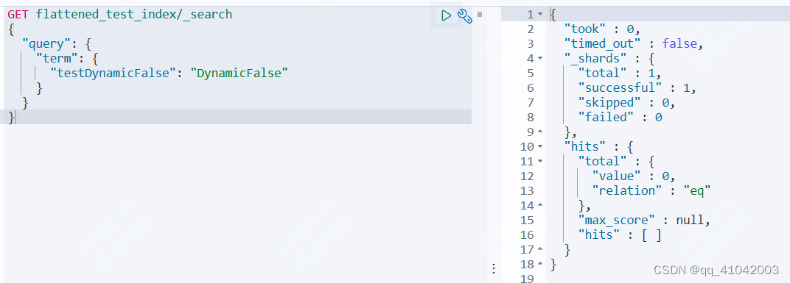

# es-字段类型-flattened

# 背景

[Elasticsearch](https://so.csdn.net/so/search?q=Elasticsearch&spm=1001.2101.3001.7020) Mapping 如果不做特殊设置，默认为 dynamic。

dynamic 的本质就是：不加约束的动态添加字段。这样对某些场景，可能会产生大量的未知字段。字段如果持续激增，就会达到 Elasticsearch Mapping 层面的默认上限，对应设置和默认大小为：index.mapping.total_fields.limit：1000
这种非预期字段激增的现象或结果称为：字段膨胀。

# 一、设置dynamic：“false”

如果索引中的字段是预知的，可以加上dynamic："false"的限制，dynamic 设置为 false 后，新来的非 mapping 预设字段数据可以写入，但是：不能被检索，仅支持 Get 获取文档的方式通过 _source 查看详情内容。

- 这里新建一个索引flattened_test_index

- 设置mapping为：

  

- 新建一个doc，设置一个不被mapping的字段testDynamicFalse

  

- 对doc为4的文档进行docId的检索，发现此文档已经写入es，并可以返回

  

- 对testDynamicFalse字段进行检索，发现不能检索到。验证dynamic："false"的结果：dynamic 设置为 false 后，新来的非 mapping 预设字段数据可以写入，但是：不能被检索，仅支持 Get 获取文档的方式通过 _source 查看详情内容。

  

# 二、设置dynamic：“strict”

设置为 strict 后，再插入未mapping字段数据，会报错如下

# 三、flattened字段类型

如前分析，将 dynamic 设置为 false 或者 strict 不是最优的解决方案 ，像一些日志、电商的场景需求，统计日志，对字段类型并不能确定。但有需要被检索到。

一方面：期望能动态添加字段。strict 过于严谨会导致新字段数据拒绝写入，dynamic 过于松散会字段膨胀。另一方面：不期望索引字段膨胀。

这时Flattend 类型横空出世了。es支持版本为7.3版本

当面临处理包含大量不可预测字段的文档时，使用 Flattend 类型可以通过将整个 JSON 对象及其嵌套 Nested 字段索引为单个关键字 keyword 类型字段来帮助减少字段总数。

# 四、flattened介绍和使用方式

flattened和其他字段类型（keyword、integer、text）的设置方式一致，这里设置labels为flattened字段类型

Flattened 本质是：将原来一个复杂的 Object 或者 Nested 嵌套多字段类型统一映射为偏平的单字段类型。这里要强调的，不管原来内嵌多少个字段，内嵌多少层，有了 Flattend，一下都打平！！

- 插入数据

  

- 查看mapping
  发现mapping设置没有变化，字段没有增加，依然还是labels字段

  

- 检索
  这里针对单个字段labels、子字段labels.cargo、labels.timestamp.start做了terms和range查询，均可以检索到

  

- 更新labels字段，添加其他字段，并查看mapping及检索
  这里在labels字段下新增了truck字段，并赋值；post新索引后，发现mapping字段依然只有labels字段，没有新增字段；并且检索做terms查询，依旧可以检索到

  

- 使用script脚本时，可以从正排中获取doc字段

  

- 使用局限
  1.无法对flattened类型的字段做限制，在mapping字段爆炸后，无法统计到flattened类型的子字段有多少
  像上述测试中，前后向labels中添加了cargo、driver、timestamp、truck、updateTime等字段，但当索引doc很大时，无法统计出labels字段中有多少节点字段。
  这里的聚合统计只能看出labels中有多少buckets，对应的key看不到。

  

​       2.无法进行[number类型](https://so.csdn.net/so/search?q=number类型&spm=1001.2101.3001.7020)的统计、数值计算

​      3.无法使用highLight 高亮语法

# 五、数据结构

我们从官方的文档上了解，flattened内部的各个节点字段用的是keyword类型，而keyword类型和numeric类型是有区别的，这也有很好的说明了flattened上述的使用局限，不能统计出数值类型的各个场景

keyword类型和numeric类型的区别是哪些呢；很多场景keyword和numeric都可以满足，想之前的货源联系次数callCount字段，用keyword和numeric都可以满足筛选条件。但keyword是比numeric性能要高很多的。

keyword类型是es用来替换String类型的字段，es提供了keyword和text两种类型来代替低版本的string类型。keyword类型不支持分词，可以被筛选、统计、聚合、排序等；text类型支持分词，不支持排序、统计、聚合。两者建立的都是倒排索引。

倒排索引：
在内存中维护了词典（term dictionary）和文档列表（posting list）的映射关系，倒排索引本身对于精确匹配查询是非常快的，直接从字典中找到term，再找到posting list。

numeric类型
使用的是一个block kd tree的存储结构简称BKD树

Block KD tree介绍
kd-tree（k-dimensional树的简称），是一种对k维空间中的实例点进行存储以便对其进行快速检索的树形数据结构。这种存储结构类似于mysql里的B+数，我们知道B+数这种数据结构对于范围查找的支持是非常好的。不同于mysql， Block KD tree的叶子节点存储的是一组值的集合(block)，大概是512~1024个值一组。这也是为什么叫block kd tree。

Block KD tree对于范围查询，邻近搜索支持的非常好，尤其是多维空间的情况下。

看上图，每个节点有三个元素，所以这里K=3，不同于简单二叉树每个节点都是一个元素（如下面这个图）。这样就可以方便的在一个三维的空间进行范围的比较。

标准的二叉树

对于上图中的kd-tree，搜索的过程是这样的：首先和根节点比较第一项，小于往左，大于往右，第二层比较第二项，依次类推。每层参与比较的数据是不一样的。

具体的ES内部（其实是Lucene），目前的版本是基于所谓的PointValues，比如整型在Lucene内部是IntPoint类表示，还有DoublePoint等，完整的对应关系是：

而这些PointValues是基于kd-tree存储的，根据官方文档的介绍，lucene把叶子节点在磁盘是顺序存储的，这样搜索的效率就会非常高。

为啥numeric对于term精确匹配的查询性能没有keyword好

前面我们提到了IntPoint类，精确匹配的查询底层走的还是范围查询

在lucene内部其实还是进行了一个2~2的范围查询。即便kd-tree的性能也很高，但是对于这种精确查询还是要到树上走一遭，而倒排索引相当于是直接在内存里就定位到了结果集的文档id。

————————————————
版权声明：本文为CSDN博主「qq_41042003」的原创文章，遵循CC 4.0 BY-SA版权协议，转载请附上原文出处链接及本声明。
原文链接：https://blog.csdn.net/qq_41042003/article/details/128446338