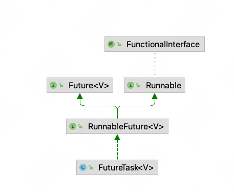
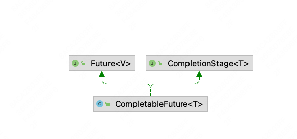

# 1. 进程、线程、管程

## 1.1 进程

是程序的一次执行，是系统进行资源分配和调度的独立单位，每一个进程都有它自己的内存空间和系统资源


## 1.2 线程

1. 同一个进程可以执行多个任务，每一个任务就是一个线程
2. 一个进程会有1个或多个线程


## 1.3 Monitor

Monitor其实是一种同步机制，它的义务是保证（同一时间）只有一个线程可以访问被保护的数据和代码。

JVM中同步是基于进入和退出监视器对象（Monitor，管程对象）来实现的，每个对象实例都会有一个Monitor对象，

```java
 Object object = new Object();
        new Thread(()->{
            synchronized (object){

            }

        },"t1").start();
```

Monitor对象会和Java对象一同创建并销毁，它底层是由C++语言来实现的。

执行线程就要求先成功持有**<font color="red">管程</font>**，然后才能执行方法，最后当方法完成（无论是正常完成还是非正常完成）时释放管程。在方法执行期间，执行线程有了管程，其他任何线程都无法获取到同一个管程。


# 2. 用户线程和守护线程

## 2.1 守护线程

是一种特殊的线程，在后台默默地完成一些系统性的服务，比如垃圾回收线程；

当程序中所有用户线程执行完毕后，不管守护线程是否结束，系统都会自动退出；

设置守护线程，需要在start() 方法之前。


## 2.2 用户线程

系统的工作线程，会完成这个程序需要完成的业务操作


# 3. CompletableFuture

## 3.1 Future 和 Callable 接口

Future接口定义了操作异步任务执行一些方法，如获取异步任务的执行结果、取消任务的执行、判断任务是否被取消、判断任务执行是否完毕等；

Callable接口定义了需要有返回的任务，需要实现的方法。



**缺点：**

